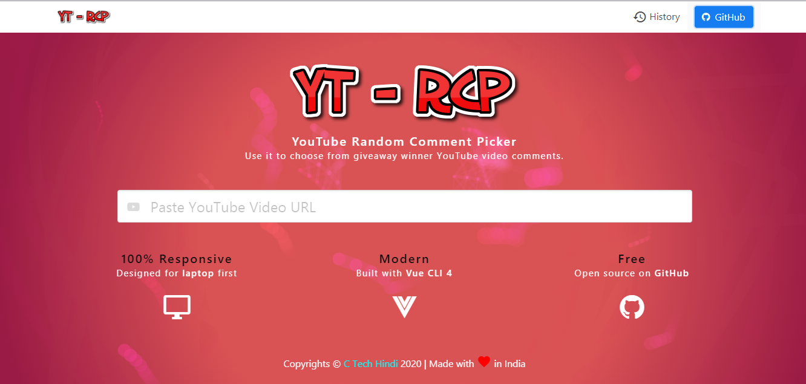
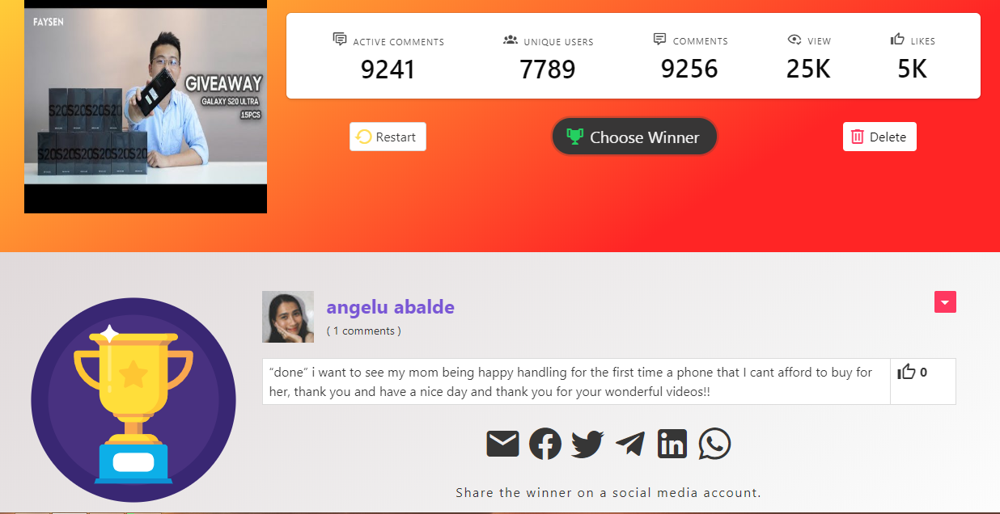
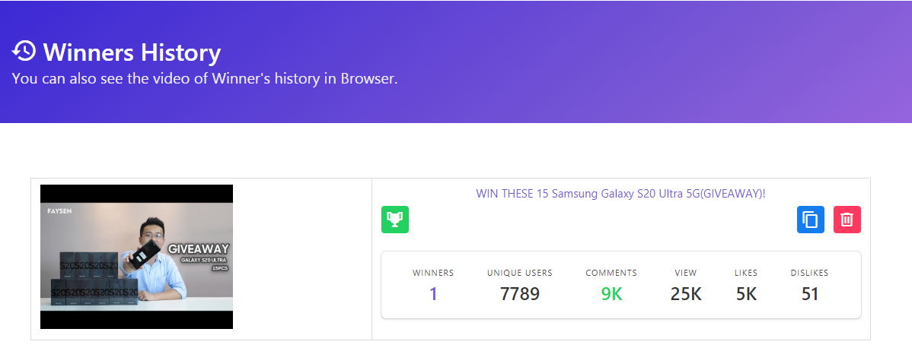

# YouTube Comment Picker V3.0.0

Use it to choose from giveaway winner YouTube video comments.

[](https://github.com/ctechhindi/YouTube-Comment-Picker/stargazers)
[](https://github.com/ctechhindi/YouTube-Comment-Picker/network)
[](https://github.com/ctechhindi/YouTube-Comment-Picker/issues)
[](http://hits.dwyl.com/ctechhindi/YouTube-Comment-Picker)
[](https://github.com/ctechhindi/YouTube-Comment-Picker/issues)


## 🌎 [Open Site](https://yt-rcp.netlify.app)

## Features

- Selecting a random comment from one of the YouTube video comments.
- Picking random winner from video comments.
- Generating SVG and QR codes to the winner's data.
- Sharing the winner's data on Social Media Account.
- Comment Picker you can `Play` and `Pause` according to your need.
- YouTube Video and winner's data are saved in the Browser Local Storage (IndexedDB).
- Our Project's `API` runs Multi Request at a time which gives us `Super Speed`.

## Screenshot








## Using Libraries

| Library Name | Version | NPM |
| ------------ | ------- | --- |
| [Vue CLI](https://cli.vuejs.org/) | 4.3.1 | `npm install -g @vue/cli` |
| [Buefy](https://buefy.org/) | 0.8.15 | `npm install buefy` |
| [materialdesignicons](https://materialdesignicons.com) | 5.1.45 | `Vender` |
| [vue-analytics](https://github.com/MatteoGabriele/vue-analytics) | 5.22.1 | `npm install vue-analytics` |
| [axios](https://github.com/axios/axios) | 0.19.2 | `npm install axios` |
| [Numeral-js](https://github.com/adamwdraper/Numeral-js) | 2.0.6 | `npm install numeral` |
| [download-js](https://github.com/rndme/download) | 1.4.7 | `npm install downloadjs` |
| [vue-qrcode](https://github.com/fengyuanchen/vue-qrcode) | 1.0.2 | `npm install @chenfengyuan/vue-qrcode vue` |
| [vue-social-sharing](https://github.com/nicolasbeauvais/vue-social-sharing) | 2.4.7 | `npm install --save vue-social-sharing` |
| [dexie](https://github.com/dfahlander/Dexie.js) | Required `2.0.1` | `npm install dexie` |
| [vue-clipboards](https://github.com/zhuowenli/vue-clipboards) | 1.3.0 | `npm install vue-clipboards` |
| [vue-progressbar](http://hilongjw.github.io/vue-progressbar/index.html) | 0.7.5 | `npm install vue-progressbar` |
| [random-js](https://github.com/ckknight/random-js) | 2.1.0 | `npm install random-js` |
| [lodash-js](https://www.npmjs.com/package/lodash) | 4.17.15 | `npm i --save lodash` |
| [vue-meta](https://github.com/nuxt/vue-meta) | 2.3.3 | `npm install vue-meta --save` |
| [animate.css](https://github.com/daneden/animate.css) | 3.7.2 | `CSS` |

## Browser Support 🏁

It's being tested on:

* ☑️ Chrome (Latest) 
* ☑️ Firefox (Latest)
* ☑️ Internet Explorer (Latest)
* ☑️ Internet Explorer 10
* ☑️ Safari (desktop and iOS)

Internet Explorer (10+) is only partially supported.

## Project setup

```
npm install
npm run serve
npm run build
```

## Changelog

### [3.0.0] - 2020-04-19

* New Design
* Upgrade Library

## Other Projects

* https://youtube-cm2.netlify.app/#/
* https://youtubeblade.netlify.app/#/
* https://speedtyping.in/

## Reporting Issues ☢️

If you have a problem with this plugin or found any bug, please open an issue on [GitHub](https://github.com/ctechhindi/School-Pi-Design-Own-Website/issues).

## Copyright and License ©️

Code copyright 2020 ctechhindi. Code released under the [MIT license](http://www.opensource.org/licenses/MIT)